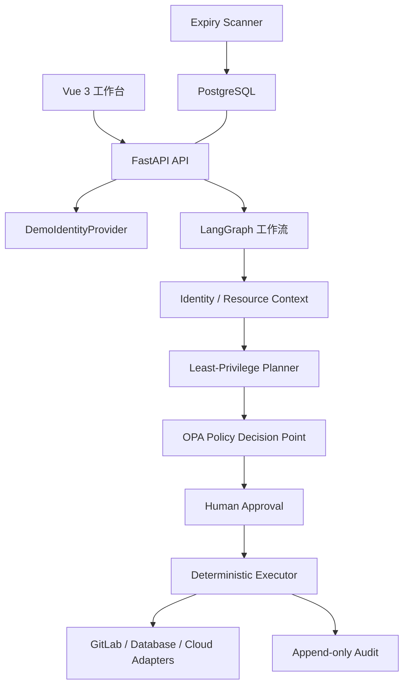

# AccessMesh

AccessMesh 是一个面向企业权限申请与最小权限治理场景的个人开源项目。项目目标是验证一条受确定性策略约束的 Multi-Agent 工作流：Agent 负责理解申请、收集上下文和提出候选权限方案；OPA、人工审批和确定性执行器负责最终决策与执行边界。

> 当前状态：`v0.1 scaffold`。仓库已经具备可继续开发的前后端基础框架和本地 Docker 环境，但完整 Agent 规划、审批、Saga 执行与评测能力尚未实现。README 会明确区分“已经具备”和“后续计划”，避免把设计目标描述成现有成果。

## 核心原则

- LLM 只能提出候选方案，不能直接批准或执行权限。
- OPA 是独立于 Agent 的确定性策略决策点，策略服务不可用时默认拒绝。
- 每个 Agent 只能访问完成职责所需的工具。
- 外部授权使用结构化命令，不接收自然语言参数。
- v0.1 使用仿真用户、资源和 IAM Adapter，不连接真实生产系统。
- 最终版本将覆盖幂等、Saga 补偿、状态验证、到期回收和追加式审计。

## 当前已经完成的基础框架

### 后端

- FastAPI 应用、版本化 API 路由和健康检查。
- PostgreSQL + SQLAlchemy Async + Alembic 初始迁移。
- DemoIdentityProvider 和四个种子演示身份。
- 用户、资源、权限申请、审计事件基础领域模型。
- 权限申请创建、列表、详情和资源查询 API。
- `ResourceAdapter` 协议及 GitLab、Database、Cloud 三类内存适配器注册表。
- 幂等 Grant/Revoke/Check 的内存适配器示例。
- Fail-Closed 的 OPA HTTP Client。
- LangGraph 状态和基础节点骨架。
- 独立到期扫描进程入口，目前只完成运行框架。
- Adapter、Graph、OPA Client 基础测试。

### 前端

- Vue 3 + TypeScript + Vite。
- Vue Router、Pinia、Element Plus、Axios。
- Demo 身份切换器。
- 概览、创建申请、申请列表、申请详情、待审批、权限与审计页面骨架。
- Axios 自动附加 `X-Demo-Subject-Id`。
- Nginx 静态托管和 `/api` 反向代理配置。

### 本地环境

- Docker Compose 编排 PostgreSQL、OPA、FastAPI、Vue/Nginx 和 expiry-scanner。
- OPA Rego 示例策略及两个策略用例。
- Python、Vue 和数据库迁移基础 CI。

## 当前未实现

以下能力属于后续迭代，不应被视为当前成果：

- 真正的 LLM 请求解析、Identity/Resource 并行 Agent 和最小权限规划。
- LangGraph Interrupt 人工审批和 PostgreSQL Checkpointer。
- OPA 与 Agent 工作流的完整 Replan 闭环。
- 执行计划冻结、数据库幂等表、Saga 补偿和最终权限验证。
- permission_instances、回收任务表和真实到期回收逻辑。
- 60 条目标评测集以及规则、单 Agent、多 Agent 对照实验。
- Keycloak、真实 GitLab、真实数据库授权或云 IAM 接入。

## 架构概览



当前仓库已经实现图中的基础服务、接口和占位节点；虚线含义不在图中单独表示，具体完成情况以“当前已经完成”和“当前未实现”为准。

## 技术栈

| 层级 | 技术 |
|---|---|
| Agent编排 | LangGraph |
| 后端 | Python 3.12、FastAPI、Pydantic |
| 数据访问 | SQLAlchemy Async、Alembic、PostgreSQL |
| 策略引擎 | Open Policy Agent、Rego |
| 前端 | Vue 3、TypeScript、Vite、Element Plus、Pinia |
| HTTP | Axios、httpx |
| 测试 | Pytest、Vitest/Vue Test Utils（已配置，前端用例待补） |
| 部署 | Docker Compose、Nginx |

## 快速启动

### 前置条件

- Docker Desktop，支持 `docker compose`
- 推荐至少 4 GB 可用内存

### 1. 配置环境变量

```bash
cp .env.example .env
```

本地 Docker 配置默认使用演示账号和弱密码，仅用于开发环境。

### 2. 启动全部服务

```bash
docker compose up --build -d
```

首次启动会：

1. 创建 PostgreSQL 数据库。
2. 执行 Alembic 迁移。
3. 写入演示用户和资源。
4. 启动 OPA、API、Vue/Nginx 和到期扫描进程。

### 3. 访问服务

| 服务 | 地址 |
|---|---|
| Vue工作台（Docker） | http://localhost:15173 |
| FastAPI Swagger | http://localhost:18000/docs |
| 健康检查 | http://localhost:18000/api/v1/health |
| OPA | http://localhost:8181/health |
| PostgreSQL | localhost:55432 |

### 4. 查看日志与停止

```bash
docker compose logs -f api web opa postgres
docker compose down
```

如需同时删除本地演示数据：

```bash
docker compose down -v
```

## 非Docker开发

### 后端

```bash
python3.12 -m venv .venv
source .venv/bin/activate
pip install -e '.[dev]'
```

本地直接启动后端时，需要可访问的 PostgreSQL 和 OPA，并调整 `.env` 中的主机地址：

```bash
alembic upgrade head
python -m accessmesh.db.seed
uvicorn accessmesh.main:app --reload
```

### 前端

```bash
cd apps/web
npm install
npm run dev
```

Vite 会将 `/api` 代理到 `http://localhost:8000`。

## 演示身份

| external_id | 角色 | 用途 |
|---|---|---|
| `user-requester` | requester | 创建并查看自己的申请 |
| `user-approver` | approver | 后续审批流程 |
| `user-auditor` | auditor | 后续只读审计查询 |
| `user-contractor` | requester/contractor | 验证外包人员策略限制 |

前端会把选择结果写入 `X-Demo-Subject-Id`。这不是认证机制，只能在 `DEMO_IDENTITY_ENABLED=true` 的仿真环境使用。

## 已有API

```text
GET  /api/v1/health
GET  /api/v1/demo/users
GET  /api/v1/resources
POST /api/v1/access-requests
GET  /api/v1/access-requests
GET  /api/v1/access-requests/{request_id}
```

创建权限申请示例：

```bash
curl -X POST http://localhost:18000/api/v1/access-requests \
  -H 'Content-Type: application/json' \
  -H 'X-Demo-Subject-Id: user-requester' \
  -d '{
    "subject_external_id": "user-requester",
    "request_text": "申请支付项目代码只读和测试库查询权限30天",
    "client_request_id": "demo-001"
  }'
```

## OPA策略

策略入口位于 `policies/access.rego`，当前示例覆盖：

- 主体必须在职。
- 资源必须启用。
- 权限必须属于资源允许集合。
- 生产环境最长 7 天，非生产环境最长 30 天。
- 外包人员禁止访问生产资源。

验证策略：

```bash
docker compose run --rm opa test /policies -v
```

## 项目结构

```text
AccessMesh/
├── apps/
│   ├── api/src/accessmesh/
│   │   ├── adapters/       # 资源适配器协议与Mock实现
│   │   ├── api/            # FastAPI路由与依赖
│   │   ├── db/             # SQLAlchemy模型、Session与种子数据
│   │   ├── domain/         # 枚举与Pydantic Schema
│   │   ├── graph/          # LangGraph状态和工作流骨架
│   │   ├── identity/       # Demo身份抽象
│   │   ├── jobs/           # 独立到期扫描进程
│   │   └── policy/         # OPA客户端
│   └── web/                # Vue 3前端
├── migrations/             # Alembic迁移
├── policies/               # Rego策略和测试
├── infra/docker/           # API、Web镜像和Nginx配置
├── datasets/               # 后续评测数据
├── docs/                   # 架构与ADR
├── docker-compose.yml
└── pyproject.toml
```

## 常用命令

```bash
make up             # 构建并启动
make down           # 停止服务
make logs           # 查看核心服务日志
make test           # 后端单元测试
make lint           # Python和Vue静态检查
make policy-test    # OPA策略测试
make migrate        # 执行数据库迁移
make seed           # 写入演示数据
```

## 下一阶段

基础框架之后，建议按以下顺序继续：

1. 完成 RequestParser、IdentityContext、ResourceContext 和 Planner Agent。
2. 将 OPA 评估节点接入 LangGraph，并实现有限 Replan。
3. 增加 Interrupt 单步审批和持久化 Checkpoint。
4. 增加执行任务、权限实例、幂等与 Saga 补偿。
5. 完成到期回收和审计页面。
6. 建立60条目标用例及三组对照实验。

## 安全声明

AccessMesh v0.1 是个人开源仿真项目。请勿把 DemoIdentityProvider、内存适配器、默认数据库密码或示例 OPA 策略用于真实生产授权。任何生产化尝试都必须重新完成身份认证、密钥管理、策略评审、安全测试和外部系统权限隔离。

## License

项目暂未选择最终开源许可证，首次公开发布前应补充 `LICENSE`。
